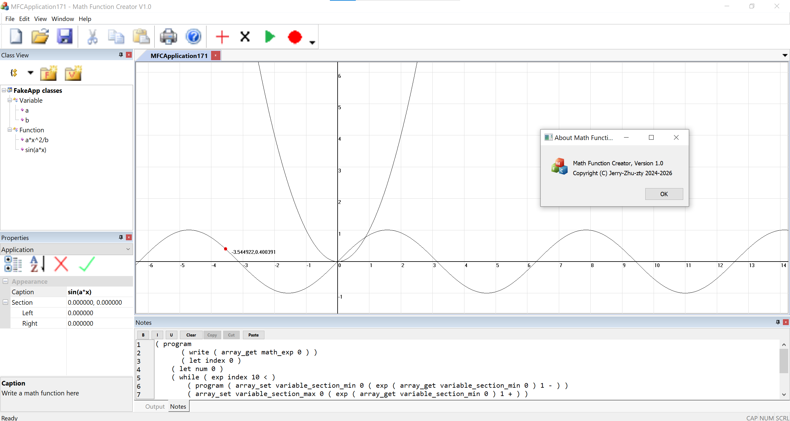
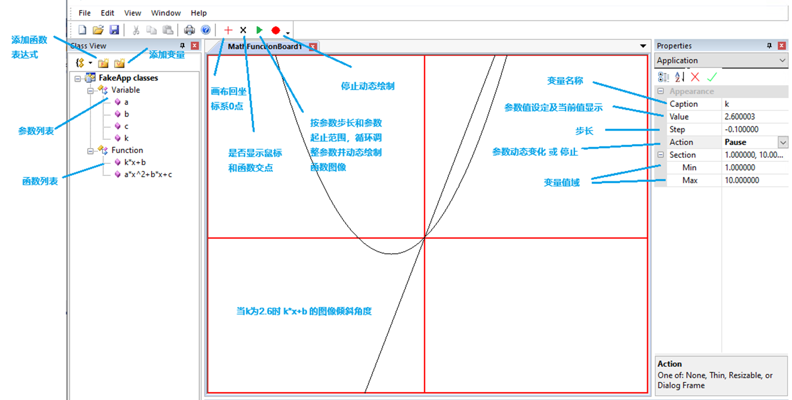

# Math Function Creator

> 融合了脚本执行能力和数学表达式处理的数学函数可视化软件

##  简介

- 绘制基本数学函数
- 通过变量改变步长实现动画
- 内置脚本执行引擎[miniscript](https://github.com/Jerry-Zhu-zty/Mini-script)，可定制函数动画

##  技术栈

- C++
- MFC
- Win32
- Visual Studio

---

##  项目结构

```text
MFCApplication17/
  ├── ChildFrm.cpp / .h           # 子窗口框架
  ├── MainFrm.cpp / .h            # 主窗口框架
  ├── MFCApplication17.cpp        # 应用入口
  ├── MFCApplication17Doc.cpp     # 文档类
  ├── MFCApplication17View.cpp    # 视图类
  ├── Script.cpp / .h             # 脚本引擎实现
  ├── Coordinate.cpp / .h         # 坐标/绘图相关逻辑
  ├── MathExpression.cpp / .h     # 数学表达式处理
  ├── Variable.cpp / .h           # 变量管理
  ├── Resource files              # 图标、菜单、对话框资源
  └── res/                        # 资源文件目录
```

---

##  如何运行

### 环境要求

- Windows 操作系统
- Visual Studio 2019 或更高版本
- 已安装 C++ 桌面开发工作负载
- MFC 支持

### 编译步骤

1. 打开解决方案文件：
   - MFCApplication17.sln
2. 选择合适的配置（例如 Debug / x64）
3. 生成解决方案
4. 运行生成出的可执行文件

#### 请确保Visual Studio已安装C++ MFC for x64/x86组件
---

## 效果展示



## 许可证
GPL Version 2